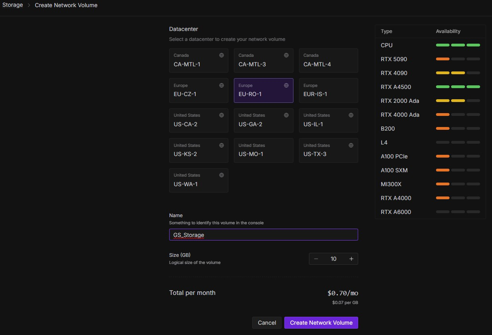
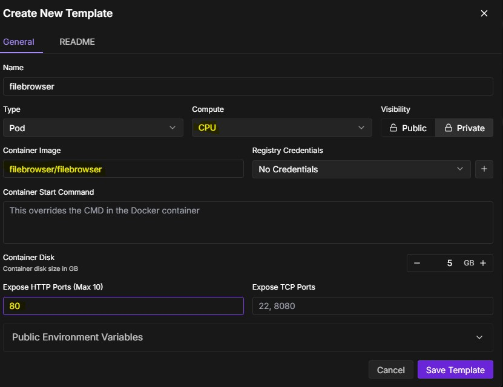
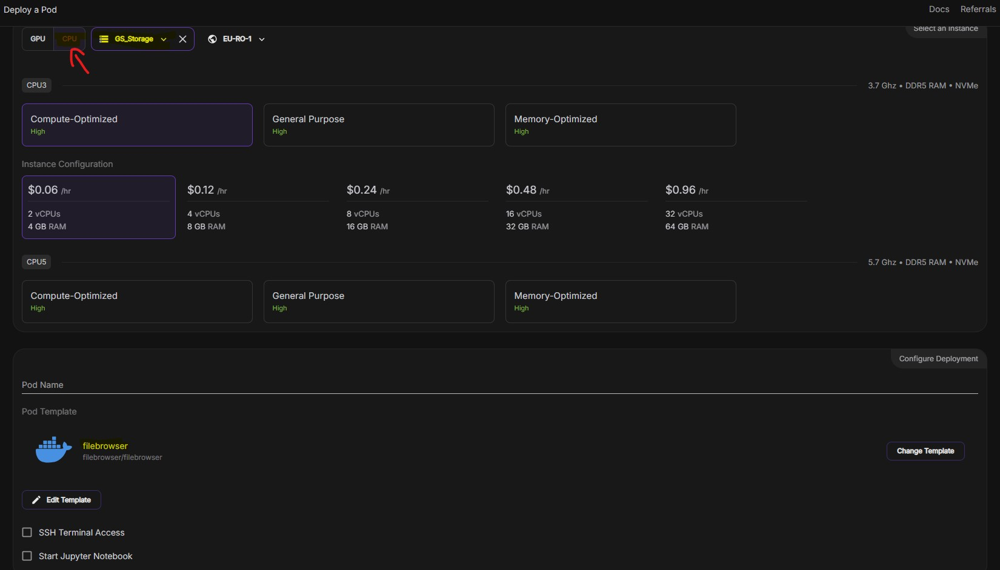
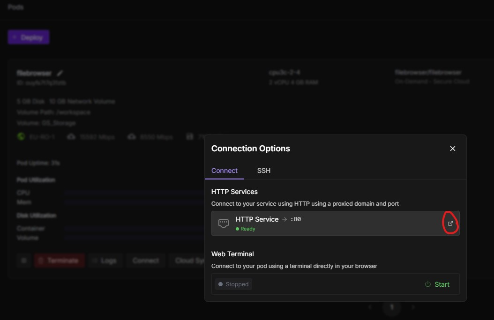
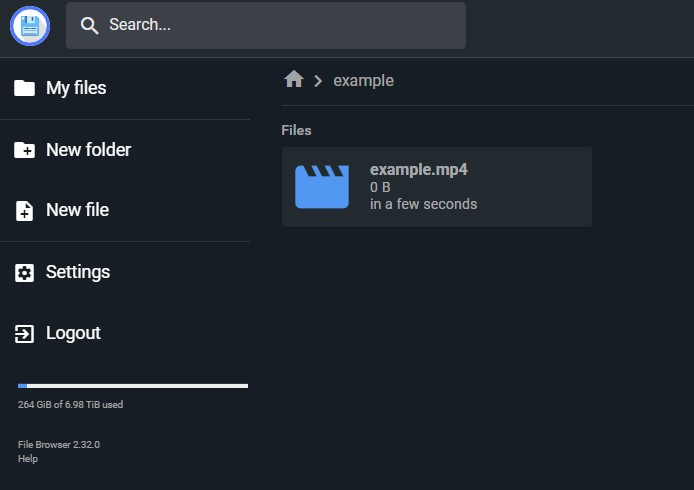
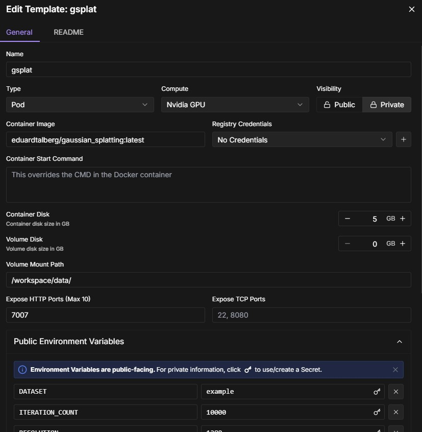
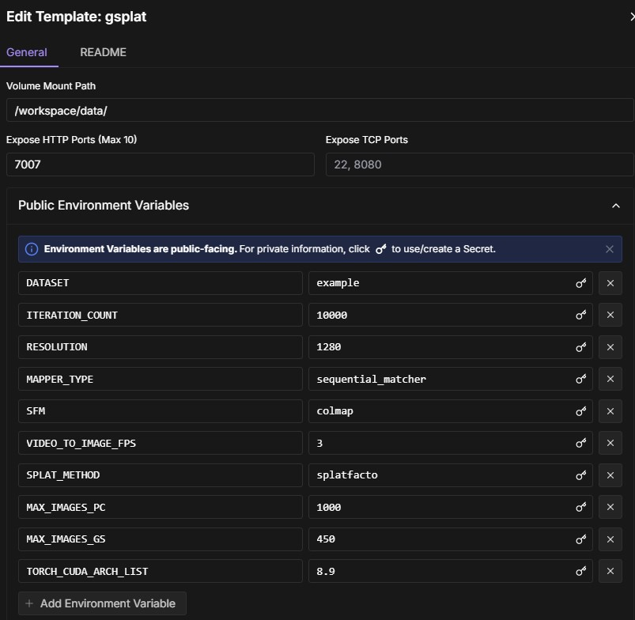

# Getting started
Just adjust the environment variables in the settings.env and put your data in the data folder with the following structure: 
- data
- - dataset_name
- - - images
e.g.
- data
- - truck
- - - images

You can also provide a video instead of a set of images in the images folder. But in this case you have to remove the images folder, otherwise the image extract process will be skipped. The video filename should be the same as the dataset_name, e.g. truck.mp4 or truck.mov.

You can start the process with the `docker compose up` command. The whole process is:

1. [if video] extract images from the video
2. [if video] preprocess the images with https://github.com/SharkWipf/nerf_dataset_preprocessing_helper.git
3. SfM with Colmap/Glomap
4. Convert to nerfstudio format
5. Train the Splat

Every Step creates a folder in the dataset folder and if something fails, you can delete the last folder and restart the process and it will continue with the given data. ONLY the ns-train folder will be removed after a successful training.

# RunPod

To start this pipeline in runpod you have to create a storge at first:

After that you need a template and a pod to manage your files on the storage. You can deploy the filebrowser to the cheapest cpu hardware. Please be aware that you connect the network storage to the pod. Sometimes you have to refresh the browser to see it in the list. On the "Deploy a Pod" screen, go to edit template and change the volume mount path to '/srv' to ensure that you manage the network storage instead of a local folder.

To connect to the filebrowser you can just press link at the pod overview. You can login with the user admin and the passwort admin. I recommend you to change the admin password.

In the filebrowser you have to create your gaussian splat project folder and upload your video OR your images in a images folder.

After that we can add the template and the pod for the gaussian splat pipeline. Please check that you attached the network storage, you created before and check the "Volume Mount Path" and the "Public Environment Variables", the dataset is the name of your project folder in the storage.

After the creation of the pod it will start immediately to create images out of the video, structure-from-motion (colmap or glomap) and gaussian splatting. Currently the pipeline will start over and over again so you have to terminate the pod when its done or you can just ignore it.

Please check the logs of the gaussian splat pipeline pod, when there is something wrong it will try to execute task by task over and over again without any progress.

There is one structure-from-motion step that is currently not working with the gpu and therefore its very slow. I hope i will find a way to fix this. Feel free to contribute :smile:

# Known Issues
- I do not recommend to use the viewer while training, because the chance is high that the training will fail.
- GLOMAP is currently not working